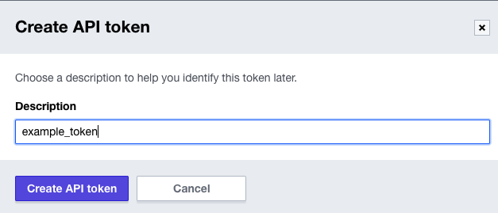
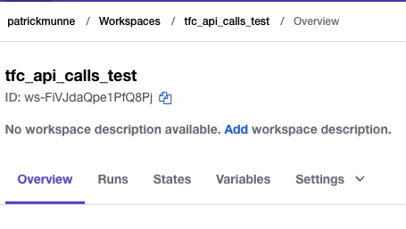
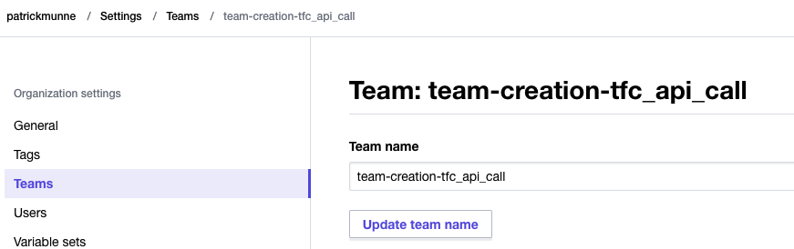
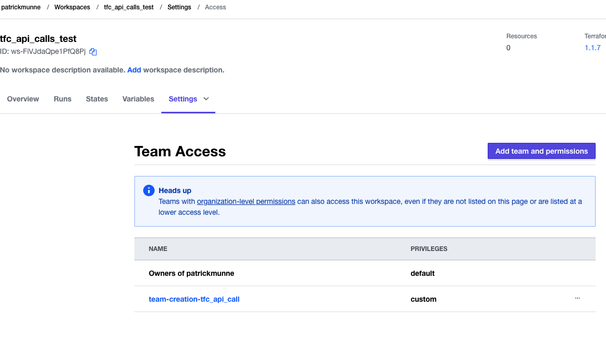

# tfc_api_calls

In this repo you will do the following as an example on how to use API calls with Terraform Cloud

- create a workspace in TFC cloud
- create a team in TFC cloud
- associate the team with the workspace
- remove the team from the workspace
- remove the workspace

For the official documentation see the following link: [Terraform Cloud API Documentation](https://www.terraform.io/cloud-docs/api-docs)

# Prerequisites

## Terraform Cloud Token

Make sure you have a Terraform Cloud token from a user that has privileges to create workspaces and other teams.

- Login to Terraform Cloud
- go to the top right corner and click user settings  
  
- go to tokens and click on create token  
  
- give a description and click create API token  
  
- A new screen will pop-up with the token. Copy this token and store it. You are not able see it again
- This token can be used to authenticate for the API


# How to

- Clone this repository
```
git clone https://github.com/munnep/tfc_api_calls.git
```
- Change directory into the cloned git folder
```
cd tf_api_calls
```
- export your token and organization to access the API and correct organization
```
export TOKEN=your_api_token
export ORGANIZATION=your_organization_name
```
- create a workspace. The details you can find in the file ```create_workspace.json```. We will create a workspace named tfc_api_calls_test
```
curl \
  --header "Authorization: Bearer $TOKEN" \
  --header "Content-Type: application/vnd.api+json" \
  --request POST \
  --data @create_workspace.json \
  https://app.terraform.io/api/v2/organizations/${ORGANIZATION}/workspaces
```

output.
You see all the details associated with this workspace

```json
{
    "data": {
        "id": "ws-FiVJdaQpe1PfQ8Pj",
        "type": "workspaces",
        "attributes": {
            "allow-destroy-plan": true,
            "auto-apply": false,
            "auto-destroy-at": null,
            "created-at": "2022-03-15T13:26:06.382Z",
            "environment": "default",
            "locked": false,
            "name": "tfc_api_calls_test",
            "queue-all-runs": false,
            "speculative-enabled": true,
            "structured-run-output-enabled": true,
            "terraform-version": "1.1.7",
            "working-directory": null,
            "global-remote-state": false,
            "updated-at": "2022-03-15T13:26:06.382Z",
            "resource-count": 0,
            "apply-duration-average": null,
            "plan-duration-average": null,
            "policy-check-failures": null,
            "run-failures": null,
            "workspace-kpis-runs-count": null,
            "latest-change-at": "2022-03-15T13:26:06.382Z",
            "operations": true,
            "execution-mode": "remote",
            "vcs-repo": null,
            "vcs-repo-identifier": null,
            "permissions": {
                "can-update": true,
                "can-destroy": true,
                "can-queue-destroy": true,
                "can-queue-run": true,
                "can-queue-apply": true,
                "can-read-state-versions": true,
                "can-create-state-versions": true,
                "can-read-variable": true,
                "can-update-variable": true,
                "can-lock": true,
                "can-unlock": true,
                "can-force-unlock": true,
                "can-read-settings": true,
                "can-manage-tags": true
            },
            "actions": {
                "is-destroyable": true
            },
            "description": null,
            "file-triggers-enabled": true,
            "trigger-prefixes": [],
            "source": "tfe-api",
            "source-name": null,
            "source-url": null,
            "tag-names": []
        },
        "relationships": {
            "organization": {
                "data": {
                    "id": "patrickmunne",
                    "type": "organizations"
                }
            },
            "current-run": {
                "data": null
            },
            "latest-run": {
                "data": null
            },
            "outputs": {
                "data": []
            },
            "remote-state-consumers": {
                "links": {
                    "related": "/api/v2/workspaces/ws-FiVJdaQpe1PfQ8Pj/relationships/remote-state-consumers"
                }
            },
            "current-state-version": {
                "data": null
            },
            "current-configuration-version": {
                "data": null
            },
            "agent-pool": {
                "data": null
            },
            "readme": {
                "data": null
            }
        },
        "links": {
            "self": "/api/v2/organizations/patrickmunne/workspaces/tfc_api_calls_test"
        }
    }
}
```

Within TFC you should see the workspace with the workspace id  
  
- workspace details including the workspace id we need later
```
curl \
  --header "Authorization: Bearer $TOKEN" \
  --header "Content-Type: application/vnd.api+json" \
  https://app.terraform.io/api/v2/organizations/${ORGANIZATION}/workspaces/tfc_api_calls_test
```
output
```json
{
    "data": {
        "id": "ws-FiVJdaQpe1PfQ8Pj",
        "type": "workspaces",
        "attributes": {
            "allow-destroy-plan": true,
            "auto-apply": false,
            "auto-destroy-at": null,
            "created-at": "2022-03-15T13:26:06.382Z",
            "environment": "default",
            "locked": false,
            "name": "tfc_api_calls_test",
            "queue-all-runs": false,
            "speculative-enabled": true,
            "structured-run-output-enabled": true,
            "terraform-version": "1.1.7",
            "working-directory": null,
            "global-remote-state": false,
            "updated-at": "2022-03-15T13:26:06.382Z",
            "resource-count": 0,
            "apply-duration-average": null,
            "plan-duration-average": null,
            "policy-check-failures": null,
            "run-failures": null,
            "workspace-kpis-runs-count": null,
            "latest-change-at": "2022-03-15T13:26:06.382Z",
            "operations": true,
            "execution-mode": "remote",
            "vcs-repo": null,
            "vcs-repo-identifier": null,
            "permissions": {
                "can-update": true,
                "can-destroy": true,
                "can-queue-destroy": true,
                "can-queue-run": true,
                "can-queue-apply": true,
                "can-read-state-versions": true,
                "can-create-state-versions": true,
                "can-read-variable": true,
                "can-update-variable": true,
                "can-lock": true,
                "can-unlock": true,
                "can-force-unlock": true,
                "can-read-settings": true,
                "can-manage-tags": true
            },
            "actions": {
                "is-destroyable": true
            },
            "description": null,
            "file-triggers-enabled": true,
            "trigger-prefixes": [],
            "source": "tfe-api",
            "source-name": null,
            "source-url": null,
            "tag-names": []
        },
        "relationships": {
            "organization": {
                "data": {
                    "id": "patrickmunne",
                    "type": "organizations"
                }
            },
            "current-run": {
                "data": null
            },
            "latest-run": {
                "data": null
            },
            "outputs": {
                "data": []
            },
            "remote-state-consumers": {
                "links": {
                    "related": "/api/v2/workspaces/ws-FiVJdaQpe1PfQ8Pj/relationships/remote-state-consumers"
                }
            },
            "current-state-version": {
                "data": null
            },
            "current-configuration-version": {
                "data": null
            },
            "agent-pool": {
                "data": null
            },
            "readme": {
                "data": null
            }
        },
        "links": {
            "self": "/api/v2/organizations/patrickmunne/workspaces/tfc_api_calls_test"
        }
    }
}
```
- create a team. See the file ```create_team.json``` for details. Team name will be team-creation-tfc_api_call
```
curl \
  --header "Authorization: Bearer $TOKEN" \
  --header "Content-Type: application/vnd.api+json" \
  --request POST \
  --data @create_team.json \
  https://app.terraform.io/api/v2/organizations/${ORGANIZATION}/teams
```
output including the team id
```json
{
    "data": {
        "id": "team-Pf5pbZothH9CXpYw",
        "type": "teams",
        "attributes": {
            "name": "team-creation-tfc_api_call",
            "users-count": 0,
            "visibility": "secret",
            "permissions": {
                "can-update-membership": true,
                "can-destroy": true,
                "can-update-organization-access": true,
                "can-update-api-token": true,
                "can-update-visibility": true,
                "can-update-name": true
            },
            "organization-access": {
                "manage-policies": false,
                "manage-workspaces": true,
                "manage-vcs-settings": false,
                "manage-policy-overrides": false,
                "manage-modules": false,
                "manage-providers": false
            }
        },
        "relationships": {
            "organization": {
                "data": {
                    "id": "patrickmunne",
                    "type": "organizations"
                }
            },
            "users": {
                "data": []
            },
            "organization-memberships": {
                "data": []
            },
            "authentication-token": {
                "meta": {}
            }
        },
        "links": {
            "self": "/api/v2/teams/team-Pf5pbZothH9CXpYw"
        }
    }
}
```
Within TFC you should see the Team as being created. Settings --> Teams  
  
- Overview of all the teams
```
curl \
  --header "Authorization: Bearer $TOKEN" \
  --header "Content-Type: application/vnd.api+json" \
  --request GET \
  https://app.terraform.io/api/v2/organizations/${ORGANIZATION}/teams
```
output for all the team including the ID
```json
{
    "data": [
        {
            "id": "team-5nHXZ62fHSskhzkn",
            "type": "teams",
            "attributes": {
                "name": "Dev-team",
                "users-count": 1,
                "visibility": "secret",
                "permissions": {
                    "can-update-membership": true,
                    "can-destroy": true,
                    "can-update-organization-access": true,
                    "can-update-api-token": true,
                    "can-update-visibility": true,
                    "can-update-name": true
                },
                "organization-access": {
                    "manage-policies": false,
                    "manage-workspaces": false,
                    "manage-vcs-settings": false,
                    "manage-policy-overrides": false,
                    "manage-modules": false,
                    "manage-providers": false
                }
            },
            "relationships": {
                "organization": {
                    "data": {
                        "id": "patrickmunne",
                        "type": "organizations"
                    }
                },
                "users": {
                    "data": [
                        {
                            "id": "user-gH8emuYZYxTi5w7K",
                            "type": "users"
                        }
                    ]
                },
                "organization-memberships": {
                    "data": [
                        {
                            "id": "ou-7ibyPXmRR6F5XRar",
                            "type": "organization-memberships"
                        }
                    ]
                },
                "authentication-token": {
                    "meta": {}
                }
            },
            "links": {
                "self": "/api/v2/teams/team-5nHXZ62fHSskhzkn"
            }
        },
        {
            "id": "team-HnSY7TsCBmpXMPrA",
            "type": "teams",
            "attributes": {
                "name": "owners",
                "users-count": 5,
                "visibility": "secret",
                "permissions": {
                    "can-update-membership": true,
                    "can-destroy": false,
                    "can-update-organization-access": false,
                    "can-update-api-token": true,
                    "can-update-visibility": false,
                    "can-update-name": false
                },
                "organization-access": {
                    "manage-policies": true,
                    "manage-workspaces": true,
                    "manage-vcs-settings": true,
                    "manage-policy-overrides": true,
                    "manage-modules": true,
                    "manage-providers": true
                }
            },
            "relationships": {
                "organization": {
                    "data": {
                        "id": "patrickmunne",
                        "type": "organizations"
                    }
                },
                "users": {
                    "data": [
                        {
                            "id": "user-rNjJE2ccQakvKm9J",
                            "type": "users"
                        },
                        {
                            "id": "user-VzNYP1V3wNpdXkZK",
                            "type": "users"
                        },
                        {
                            "id": "user-yp6sFtaQdDzWicxS",
                            "type": "users"
                        },
                        {
                            "id": "user-aGUfDdNEPnw9qDEJ",
                            "type": "users"
                        },
                        {
                            "id": "user-gH8emuYZYxTi5w7K",
                            "type": "users"
                        }
                    ]
                },
                "organization-memberships": {
                    "data": [
                        {
                            "id": "ou-BnMa9wMjZ41ZWw7w",
                            "type": "organization-memberships"
                        },
                        {
                            "id": "ou-KZpxsbnrfZhnXQzK",
                            "type": "organization-memberships"
                        },
                        {
                            "id": "ou-Q4vGkkMXavyDpaTR",
                            "type": "organization-memberships"
                        },
                        {
                            "id": "ou-w42me5ZrYjHZdgYN",
                            "type": "organization-memberships"
                        },
                        {
                            "id": "ou-7ibyPXmRR6F5XRar",
                            "type": "organization-memberships"
                        }
                    ]
                },
                "authentication-token": {
                    "meta": {}
                }
            },
            "links": {
                "self": "/api/v2/teams/team-HnSY7TsCBmpXMPrA"
            }
        },
        {
            "id": "team-Pf5pbZothH9CXpYw",
            "type": "teams",
            "attributes": {
                "name": "team-creation-tfc_api_call",
                "users-count": 0,
                "visibility": "secret",
                "permissions": {
                    "can-update-membership": true,
                    "can-destroy": true,
                    "can-update-organization-access": true,
                    "can-update-api-token": true,
                    "can-update-visibility": true,
                    "can-update-name": true
                },
                "organization-access": {
                    "manage-policies": false,
                    "manage-workspaces": true,
                    "manage-vcs-settings": false,
                    "manage-policy-overrides": false,
                    "manage-modules": false,
                    "manage-providers": false
                }
            },
            "relationships": {
                "organization": {
                    "data": {
                        "id": "patrickmunne",
                        "type": "organizations"
                    }
                },
                "users": {
                    "data": []
                },
                "organization-memberships": {
                    "data": []
                },
                "authentication-token": {
                    "meta": {}
                }
            },
            "links": {
                "self": "/api/v2/teams/team-Pf5pbZothH9CXpYw"
            }
        },
        {
            "id": "team-JzddJvmvdPh8hRZr",
            "type": "teams",
            "attributes": {
                "name": "test",
                "users-count": 0,
                "visibility": "secret",
                "permissions": {
                    "can-update-membership": true,
                    "can-destroy": true,
                    "can-update-organization-access": true,
                    "can-update-api-token": true,
                    "can-update-visibility": true,
                    "can-update-name": true
                },
                "organization-access": {
                    "manage-policies": false,
                    "manage-workspaces": false,
                    "manage-vcs-settings": false,
                    "manage-policy-overrides": false,
                    "manage-modules": false,
                    "manage-providers": false
                }
            },
            "relationships": {
                "organization": {
                    "data": {
                        "id": "patrickmunne",
                        "type": "organizations"
                    }
                },
                "users": {
                    "data": []
                },
                "organization-memberships": {
                    "data": []
                },
                "authentication-token": {
                    "meta": {}
                }
            },
            "links": {
                "self": "/api/v2/teams/team-JzddJvmvdPh8hRZr"
            }
        },
        {
            "id": "team-txC3x5eSyubA7Cia",
            "type": "teams",
            "attributes": {
                "name": "testpatrick",
                "users-count": 0,
                "visibility": "secret",
                "permissions": {
                    "can-update-membership": true,
                    "can-destroy": true,
                    "can-update-organization-access": true,
                    "can-update-api-token": true,
                    "can-update-visibility": true,
                    "can-update-name": true
                },
                "organization-access": {
                    "manage-policies": false,
                    "manage-workspaces": false,
                    "manage-vcs-settings": false,
                    "manage-policy-overrides": false,
                    "manage-modules": false,
                    "manage-providers": false
                }
            },
            "relationships": {
                "organization": {
                    "data": {
                        "id": "patrickmunne",
                        "type": "organizations"
                    }
                },
                "users": {
                    "data": []
                },
                "organization-memberships": {
                    "data": []
                },
                "authentication-token": {
                    "meta": {}
                }
            },
            "links": {
                "self": "/api/v2/teams/team-txC3x5eSyubA7Cia"
            }
        }
    ],
    "links": {
        "self": "https://app.terraform.io/api/v2/organizations/patrickmunne/teams?page%5Bnumber%5D=1\u0026page%5Bsize%5D=20",
        "first": "https://app.terraform.io/api/v2/organizations/patrickmunne/teams?page%5Bnumber%5D=1\u0026page%5Bsize%5D=20",
        "prev": null,
        "next": null,
        "last": "https://app.terraform.io/api/v2/organizations/patrickmunne/teams?page%5Bnumber%5D=1\u0026page%5Bsize%5D=20"
    },
    "meta": {
        "pagination": {
            "current-page": 1,
            "page-size": 20,
            "prev-page": null,
            "next-page": null,
            "total-pages": 1,
            "total-count": 5
        }
    }
}
```  
- associate the created team with the created workspace. Change the values in ```team_associate.json``` with the workspace_id and team_id
```
curl \
  --header "Authorization: Bearer $TOKEN" \
  --header "Content-Type: application/vnd.api+json" \
  --request POST \
  --data @team_associate.json \
  https://app.terraform.io/api/v2/team-workspaces
```
output
```json
{
    "data": {
        "id": "tws-yBEmCZXwhjtRii4J",
        "type": "team-workspaces",
        "attributes": {
            "access": "custom",
            "runs": "apply",
            "variables": "none",
            "state-versions": "read-outputs",
            "sentinel-mocks": "read",
            "workspace-locking": false
        },
        "relationships": {
            "team": {
                "data": {
                    "id": "team-Pf5pbZothH9CXpYw",
                    "type": "teams"
                },
                "links": {
                    "related": "/api/v2/teams/team-Pf5pbZothH9CXpYw"
                }
            },
            "workspace": {
                "data": {
                    "id": "ws-FiVJdaQpe1PfQ8Pj",
                    "type": "workspaces"
                },
                "links": {
                    "related": "/api/v2/organizations/patrickmunne/workspaces/tfc_api_calls_test"
                }
            }
        },
        "links": {
            "self": "/api/v2/team-workspaces/tws-yBEmCZXwhjtRii4J"
        }
    }
}
```
TFC check to go to  Workspaces -> tfc_api_calls_test -> Settings -> Access  
  
- delete the created workspace
```
curl \
  --header "Authorization: Bearer $TOKEN" \
  --header "Content-Type: application/vnd.api+json" \
  --request DELETE \
  https://app.terraform.io/api/v2/organizations/${ORGANIZATION}/workspaces/tfc_api_calls_test
```
output
```
none
```
- delete the team. Last value is team id
```
curl \
  --header "Authorization: Bearer $TOKEN" \
  --header "Content-Type: application/vnd.api+json" \
  --request DELETE \
  https://app.terraform.io/api/v2/teams/team-Pf5pbZothH9CXpYw
```
output
```
none
```
- From TFC the workspace and Team should be deleted
